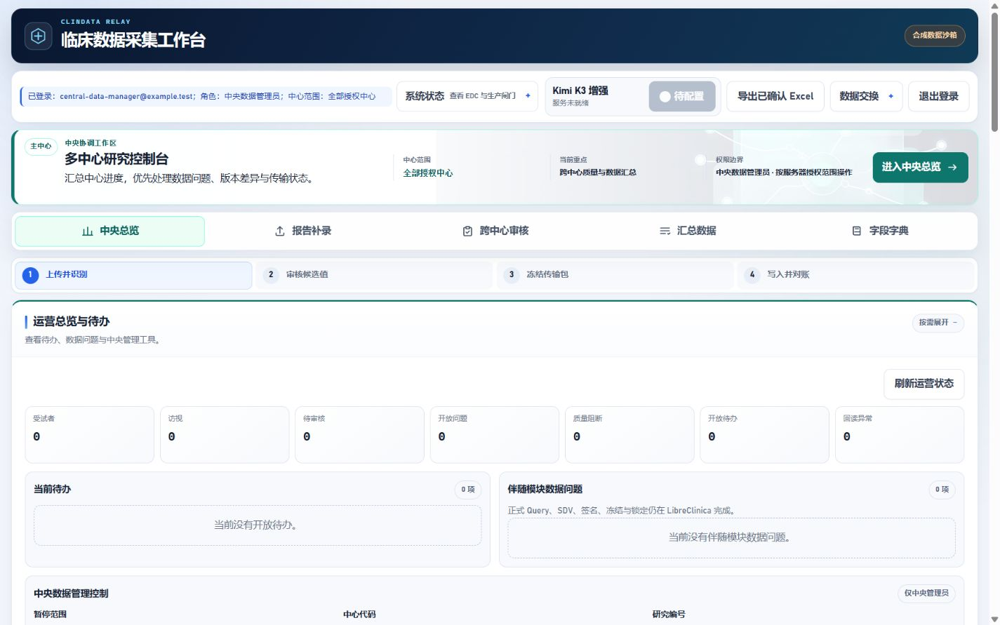
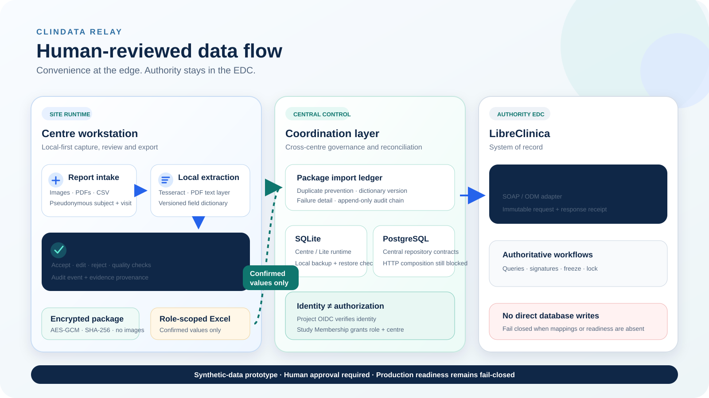

# ClinData Relay

**A human-reviewed clinical data companion for multicentre research.**
Formerly developed as *Clinical EDC Companion*.

[简体中文](README.zh-CN.md)

[](https://github.com/KR0817/clin-data-relay/actions/workflows/quality.yml)
[](https://www.python.org/)
[](#safety-boundary)
[](LICENSE)

ClinData Relay turns laboratory images, pulmonary-function PDFs and structured
files into traceable **candidate values**. Investigators review every candidate
before it can enter an immutable transfer package. LibreClinica remains the
Authority EDC; this application never writes LibreClinica database tables
directly.

That separation between the convenience layer and the authoritative record is
the product's central design decision; OCR is only one replaceable component.

> This repository is a synthetic-data research prototype. It is not a medical
> device, a validated EDC or authorization to process real participant data.



## Two-minute tour

[Watch the two-minute synthetic workflow demo](docs/demo/clin-data-relay-demo.mp4)

The demo contains only generated `.example.test` identities, a pseudonymous
subject code and synthetic laboratory values. No participant image, runtime
database, API key or private endpoint is included.

## Why it exists

Small investigator-initiated multicentre studies often receive reports in
different local formats while still needing one governed EDC record. ClinData
Relay separates the convenience layer from the record of authority:

1. A site enters a pseudonymous subject code and uploads an attested synthetic
   or locally approved report.
2. Local OCR/PDF parsing creates structured candidates. Optional Kimi assistance
   can receive only a human-confirmed de-identified derivative and bounded local
   evidence.
3. An authorized investigator accepts, edits or rejects each candidate.
4. Confirmed values become immutable, hash-verifiable transfer material.
5. The Authority EDC adapter submits through supported SOAP/ODM interfaces and
   records the response for reconciliation.

## Verified prototype capabilities

- centre-scoped local accounts and central review projections;
- image/PDF provenance with SHA-256 and local source retention controls;
- local Tesseract OCR, pulmonary-function PDF parsing and optional Kimi K3
  candidate comparison;
- human accept/edit/reject, deterministic quality gates and append-only audit
  events;
- encrypted centre packages with dictionary-version checks and duplicate-import
  protection;
- immutable transfer packages, idempotency, receipts and reconciliation state;
- role-scoped Excel export with formula-injection protection;
- Docker-free Windows Lite packaging for local recognition/review/export;
- optional PostgreSQL repository contracts and project-owned OIDC boundaries
  for a future central deployment.

Kimi remains the default model provider. The same guarded multimodal transport
can target an operator-approved OpenAI-compatible endpoint through the
[model-provider configuration](docs/model-provider-configuration.md). Custom
URLs are process-configured and exact-allow-listed; they cannot be selected in
the browser.

These are implementation and synthetic-test claims, not clinical-validation
claims. See [testing seams](docs/testing-seams.md) and the
[go-live blockers](docs/release-governance-blockers-2026-08.md).

## Architecture



The site runtime remains usable without LibreClinica or PostgreSQL. The central
runtime is deliberately fail-closed until managed identity, repository-backed
route composition and operational qualification are complete. Detailed
decisions are recorded in [the ADR index](docs/adr/).

## Quick start: synthetic localhost sandbox

For a Docker-free Windows evaluation build, use the verified archive and
SHA-256 file from the [latest release](https://github.com/KR0817/clin-data-relay/releases/latest).
Release binaries are unsigned research-prototype artifacts; inspect the source
and verification report before running them.

Requirements: Python 3.12 and
[uv](https://docs.astral.sh/uv/). Tesseract is optional unless you want to run
real local OCR.

Windows PowerShell:

```powershell
git clone https://github.com/KR0817/clin-data-relay.git
cd clin-data-relay
uv sync --all-extras --frozen
$env:COMPANION_DATABASE_PATH = ".runtime/demo/companion.db"
$env:COMPANION_ENV = "development"
$env:COMPANION_PRODUCT_MODE = "full"
$env:KIMI_ENABLED = "false"
uv run uvicorn app.main:app --host 127.0.0.1 --port 8000
```

macOS or Linux shell:

```bash
git clone https://github.com/KR0817/clin-data-relay.git
cd clin-data-relay
uv sync --all-extras --frozen
COMPANION_DATABASE_PATH=.runtime/demo/companion.db \
COMPANION_ENV=development \
COMPANION_PRODUCT_MODE=full \
KIMI_ENABLED=false \
uv run uvicorn app.main:app --host 127.0.0.1 --port 8000
```

Open <http://127.0.0.1:8000/>. The page contains disposable `.example.test`
accounts and a prefilled localhost-only synthetic credential. Never bind this
demo configuration to a non-loopback interface or reuse it in a deployment.

Run the verified source checks:

```powershell
powershell -ExecutionPolicy Bypass -File .\scripts\check_public_release.ps1
uv run python -m compileall -q app
node --check .\app\static\js\workbench.js
uv run pytest -q
```

## Repository map

```text
app/                 FastAPI application, repositories and web workbench
config/              Versioned field dictionaries, rules and EDC mappings
docs/                Contracts, ADRs, qualification boundaries and diagrams
infrastructure/      Synthetic LibreClinica sandbox only
packaging/           Portable runtime assets and recipient guides
scripts/             Launch, verification, backup and build commands
showcase/demo-video/ Reproducible Remotion source for the public demo
tests/               Unit, API and integration-boundary tests
```

## Safety boundary

- Use synthetic data by default. Real participant data requires applicable
  protocol, ethics, privacy, security, data-flow, validation and institutional
  approvals.
- Do not send names, identifiers, original reports or PHI to external models.
- OCR and model output are candidates, never final database values.
- Role and centre authorization come from application-controlled Study
  Membership, not identity-provider groups or email domains.
- LibreClinica is the Authority EDC. Direct database writes are prohibited.
- A passing test suite or demo does not establish production readiness.

Read [the preflight boundary](docs/preflight.md),
[the EDC adapter contract](docs/edc-adapter-contract.md) and
[security reporting](SECURITY.md) before evaluation.

## Current maturity

| Area | Status |
| --- | --- |
| Local synthetic workbench | Verified prototype |
| Windows Lite package | Synthetic black-box tested |
| LibreClinica SOAP/ODM | Local sandbox fit-gap evidence |
| PostgreSQL repositories | Contract tested; central HTTP not composed |
| Project OIDC | Boundary implemented; provider operation not qualified |
| Real clinical deployment | **Blocked** |

## Evaluation and development transparency

The preregistered-style [Benchmark v1 protocol](docs/eval/v1/protocol.md)
defines independent gold annotation, a 120-report locked synthetic test set,
OCR-only versus OCR-plus-model comparison, error taxonomy and report-clustered
uncertainty. No benchmark result is claimed until the frozen dataset and
evidence package exist. The earlier [v0.1 protocol](docs/evaluation/benchmark-protocol-v0.1.md)
is retained only for the metric-engine demonstration.
The [executable metric-engine example](benchmarks/synthetic-v0.1/README.md)
contains deliberately constructed synthetic predictions and must not be read as
OCR or model performance.
The [Benchmark v1 report](docs/eval/v1/REPORT.md) is explicitly
`EXPERIMENT_NOT_RUN`; its tracked [150-report allocation](benchmarks/synthetic-v1/README.md)
contains no source reports, gold values, predictions or results.

Development uses AI coding tools under explicit human control. The
[AI-assisted development disclosure](docs/development/ai-assisted-development.md)
describes what agents may do, what requires human judgment and how generated
changes are reviewed and tested. Citation metadata is available in
[`CITATION.cff`](CITATION.cff).

## Contributing and license

Review feedback and bounded pull requests are welcome; see
[CONTRIBUTING.md](CONTRIBUTING.md). Please report security issues privately as
described in [SECURITY.md](SECURITY.md), not in a public issue.

ClinData Relay is open source under `AGPL-3.0-only`; see [LICENSE](LICENSE).
Commercial use is not prohibited, but distribution and network-service use
must comply with the AGPL. Clinical and production readiness remain separate
governance questions. Third-party components retain their own licenses.
