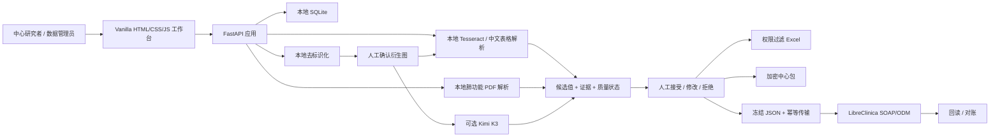

# ClinData Relay 外部技术评审说明

> 文档用途：供软件工程、临床数据管理、信息安全、隐私合规、验证与 UX 专家独立评审。  
> 评审基线：2026-08-17，本地源码版本 `0.1.0`。  
> 数据边界：本文不包含 API key、密码、患者数据、原始检查单、运行数据库或 LibreClinica 凭据。  
> 重要声明：当前证据证明的是本地/合成数据功能验证，不等于临床验证、生产验证或监管合规认证。

## 目录

1. 三十秒了解本项目
2. 当前状态与评审结论边界
3. 用户角色与权限
4. 两种运行模式
5. 总体架构
6. 核心业务流程
7. 核心代码导航
8. 数据模型
9. API 面
10. 字段字典与规则资产
11. 安全与隐私控制
12. 测试与当前证据
13. 已知技术债与建议审核优先级
14. 建议外部审核顺序
15. 复现命令
16. 提交给审核者的材料与禁止分享内容
17. 希望审核者采用的反馈格式
18. 相关文档索引

## 1. 三十秒了解本项目

ClinData Relay 是一个面向多中心研究的“临床检查报告识别与人工审核伴随工具”，不是完整 EDC。

它解决的主要问题是：

1. 研究者按去标识化病人编号上传图片或肺功能 PDF；
2. 本地完成去标识化预览、OCR 和确定性字段匹配；
3. 可选调用 Kimi K3 对已确认去标识化图片进行结构化纠错/补充；
4. 所有识别结果先进入候选队列，由有权限的研究者人工接受、修改或拒绝；
5. 已确认值可以导出 Excel、生成加密中心数据包，或经受控适配器提交到 LibreClinica；
6. 操作、质量检查、问题、冻结、传输和回读结果保留审计记录。

LibreClinica 被定义为正式临床记录的权威 EDC。伴随工具不得直接修改 LibreClinica 数据库，只能使用 SOAP/ODM 等支持的接口。

## 2. 当前状态与评审结论边界

| 项目 | 当前状态 | 审核者应如何理解 |
|---|---|---|
| 本地图片/PDF 识别 | 已实现并自动化测试 | 可评审功能正确性与可维护性 |
| Kimi K3 混合识别 | 已实现；本地 key 配置后启用 | 模型输出仍是候选，不是最终临床值 |
| 人工审核与批量接受 | 已实现并按 2026-08-17 审计收紧 | 默认仅批量接受 `agreement` / `local_only` / `local_fallback`；`conflict` 与 `kimi_only` 必须逐项查看证据并选择来源 |
| Excel 导出 | 已实现 | 导出范围受账号和中心权限过滤 |
| 加密中心包 | 已实现 | AES-256-GCM + scrypt；不含原图和 OCR 证据 |
| LibreClinica 接口 | 本地合成沙箱已验证 | 不是生产 EDC 验证结论 |
| 多中心共享服务器 | 未实现 | `central` profile 会明确拒绝启动，不会退回多用户 SQLite |
| 生产身份认证 | 未实现 | 当前存在演示/本地账号流程，无 OIDC/SAML/MFA |
| 正式临床生产就绪 | `BLOCK` | 仍缺中央 PostgreSQL、HTTPS、托管密钥、正式验证、监控与 SOP 等证据 |

## 3. 用户角色与权限

核心权限常量位于 `app/main.py` 顶部。

| 角色 | 数据范围 | 主要能力 | 当前限制/需确认事项 |
|---|---|---|---|
| `site_investigator` | 本中心 | 上传、识别、审核、中心范围导出、生成中心包 | 不得访问其他中心 |
| `central_data_manager` | 所有中心 | 跨中心审核、字典管理、账号管理、中心包批量导入、全局导出 | 生产身份体系尚未接入 |
| `principal_investigator` | 所有中心 | 全局读取、导出及部分中央管理能力 | 当前不属于 `REVIEWER_ROLES`；请审核是否符合研究方案 |
| `monitor` | 所有中心只读 | 查看任务、仪表盘、候选与审计 | 不可修改候选或源文件 |
| `auditor` | 所有中心只读 | 审计与全局只读 | 不可修改业务状态 |

项目已移除普通“录入员”产品角色。中心专用包只携带一个中心代码和一个中心研究者账号，首次使用时在本机设置随机强密码。

## 4. 两种运行模式

### 4.1 Lite 模式

适用于中心研究者本机：

- 图片/PDF 上传；
- 本地去标识化、OCR、肺功能解析；
- 可选 Kimi；
- 人工审核；
- Excel 导出；
- 加密中心包导出；
- 不显示或执行 Authority EDC 提交。

Windows Lite 包内含 Python、Tesseract 和 Excel 导出运行时，不需要 Docker、WSL、Linux 或 LibreClinica。

### 4.2 Full 模式

在 Lite 能力之上增加：

- LibreClinica SOAP/ODM 适配器；
- 研究对象自动建档和访视安排；
- 冻结传输包、幂等提交、失败重试；
- Authority 回读与人工对账。

当前 Full 模式只在 localhost 合成沙箱中验证。完整 Windows 集成包包含 Docker/LibreClinica 资产，因此更大且部署依赖更多。

## 5. 总体架构



设计原则：

- LLM 不直接写最终数据库值；
- 原图不发送给 Kimi；
- Kimi 只能收到人工确认后的去标识化衍生图、受限 OCR 证据和当前字段字典；
- 图片、PDF 和候选均保留 SHA-256 来源链；
- 外部服务不可用时 fail closed，不伪造成功状态；
- 本地识别和 Excel 导出不以 LibreClinica 在线为前提。

## 6. 核心业务流程

### 6.1 图片检查单

```text
上传原图
  -> 记录文件哈希和中心/病人/访视上下文
  -> 本地 OCR 定位身份标签并生成全新 PNG 遮盖衍生图
  -> 用户查看预览并确认
  -> 本地 OCR + 中文检验表格规则
  -> 可选 Kimi 严格 JSON Schema 提取
  -> 本地字段字典、单位和质量规则校验
  -> 生成候选值
  -> 人工审核
  -> Excel / 加密中心包 / Authority 传输
```

自动去标识化目前覆盖患者姓名、住院号、门诊号、病历号、身份证、电话、出生日期、病人编号、床号，以及送检医生、检验者、审核者和采样/签收/审核时间标签所在 OCR 行。自动遮盖可能漏检，因此预览确认仍是硬步骤。

### 6.2 Kimi 混合识别

`app/kimi.py` 的主要边界：

- 仅允许官方 Moonshot 基础 URL；
- 固定模型 `kimi-k3`；
- key 只从本机受限文件或进程环境读取；
- 请求使用严格 `json_schema`；
- 字段代码只能来自当前 CRF 字典；
- 响应状态限定为 `read | uncertain | not_visible`；
- 429/503/504 才进行有限重试；
- 原始供应商错误不直接暴露给浏览器或审计日志。

候选来源状态：

| 状态 | 含义 |
|---|---|
| `agreement` | 本地 OCR 与 Kimi 值/单位一致 |
| `conflict` | 两者不一致；记录同时保留本地值与 Kimi 值，审核时不默认选择任何一方 |
| `kimi_only` | 只有 Kimi 识别到 |
| `local_only` | 未调用 Kimi |
| `local_fallback` | 调用 Kimi 失败，使用本地 OCR |

2026-08-17 审计修复后，默认批量范围已收窄为有本地证据的 `agreement`、`local_only` 与 `local_fallback`。`conflict` 和 `kimi_only` 必须逐项加载已确认的去标识化衍生图并明确选择来源；中央数据管理员的后端例外通道还需书面理由并写入审计摘要。

### 6.3 肺功能 PDF

- 使用 `pypdf` 读取文本层；
- 完全本地处理，永不调用 Kimi；
- 基于 `肺功能.xlsx` 形成 21 个表头，其中 18 个测量字段可作为候选；
- 姓名、住院号、测试号不会成为候选；
- 加密、损坏、无文本层、超过页数限制或布局不支持的 PDF fail closed；
- 扫描版 PDF 的 OCR 回退尚未实现。

### 6.4 人工审核与质量闸门

- 单项操作：接受、修改、拒绝；理由可选；
- 批量操作：当前批次仅 `agreement` / `local_only` / `local_fallback` 可批量接受，`conflict` / `kimi_only` 转逐项证据审核；
- `PASS/WARN/BLOCK` 来自版本化确定性规则；
- `BLOCK`、有效 transfer hold、无权限、跨中心和非 pending 状态仍由后端拒绝；
- 每个被接受的候选产生独立 `candidate_human_confirmed` 审计事件；
- Kimi 结果不会直接进入 LibreClinica。

### 6.5 离线中心包

- 只包含已人工确认的去标识化值、中心代码、病人研究编号、访视、字段代码、单位、时间和来源 SHA-256；
- 明确排除原图、衍生图、OCR 文本、OCR 坐标和直接身份信息；
- 明文内容先规范化并计算 SHA-256；
- 使用 scrypt（当前写入 `N=2^17, r=8, p=1`；旧 `N=2^15` 包仅保留读取兼容）派生 256 位密钥；
- 使用 AES-256-GCM 加密并绑定元数据；
- 中央端最多一次批量导入 100 个包；
- 检查传输 SHA-256、包内 SHA-256、中心、字段字典版本和重复包；
- 每个成功/失败文件均形成导入日志；
- 导入只进入伴随数据库，不等于 LibreClinica 提交。

### 6.6 Authority EDC 传输

```text
human_confirmed candidate
  -> canonical frozen package
  -> package SHA-256
  -> immutable request receipt + receipt SHA-256
  -> explicit submit
  -> SOAP/ODM response
  -> external reference + response SHA-256
  -> optional readback / reconciliation
```

提交前会再次检查候选状态、质量、冻结、字段 OID 和包完整性。代码不直接连接或修改 LibreClinica 数据库表。

## 7. 核心代码导航

以下行数和入口基于 2026-08-17 快照，后续修改可能漂移。

| 文件 | 约行数 | 责任 | 建议审核重点 |
|---|---:|---|---|
| `app/main.py` | 6450 | API 模型、权限、业务编排、候选/审核/传输接口 | 过大；事务边界、权限一致性、错误映射、拆分计划 |
| `app/static/js/workbench.js` | 2606 | 单页工作台状态和完整交互流程 | 过大；竞态、批次恢复、可访问性、组件边界 |
| `app/edc_adapter.py` | 843 | 冻结包、收据、LibreClinica SOAP/ODM、回读 | OID 映射、幂等、网络错误、响应验证 |
| `app/persistence.py` | 591 | SQLite 连接、表结构、兼容升级、演示数据 | 迁移策略、索引、并发、完整性约束 |
| `app/kimi.py` | 347 | Kimi 配置、严格请求/响应、重试、key 文件 | 隐私边界、超时、供应商错误、Schema 完整性 |
| `app/offline_package.py` | 315 | 中心包规范化、哈希、加解密、防重复基础 | KDF 参数、口令策略、元数据绑定、标识符检测 |
| `app/spreadsheet_export.py` | 232 | Excel 生成与 openpyxl 回退 | 权限投影、公式注入、字段顺序、数据类型 |
| `app/pulmonary_function.py` | 225 | 肺功能字典和文本 PDF 解析 | 布局差异、数值选择、单位、扫描 PDF |
| `app/production_readiness.py` | 200 | 非秘密生产证据清单和 fail-closed 闸门 | 闸门覆盖范围、有效期、绕过可能性 |
| `app/chinese_lab.py` | 188 | 中文检验表格精确标签/坐标解析 | 同名项目、计数/百分比歧义、单位保留 |
| `app/deidentification.py` | 126 | OCR 行级身份标签遮盖和新 PNG 输出 | OCR 漏检、过度遮盖、签名/时间识别 |
| `app/ocr.py` | 128 | Tesseract 子进程、语言和超时 | 文件路径、进程限制、资源耗尽 |
| `app/quality.py` | 118 | 版本化 PASS/WARN/BLOCK | 临床合理范围、单位标准化、规则覆盖率 |
| `app/runtime_config.py` | 63 | Full/Lite 和本地部署配置 | 中央模式明确 fail closed |
| `app/security.py` | 90 | scrypt 密码、强密码、验证兼容 | 演示旧哈希兼容、会话吊销、生产身份替换 |

关键入口：

| 入口 | 当前位置 | 作用 |
|---|---|---|
| `create_app` | `app/main.py:765` | 依赖装配和 FastAPI 应用工厂 |
| `health` | `app/main.py:2060` | 能力、配置和生产闸门状态 |
| `create_recognition_job` | `app/main.py:2655` | 持久化多文件识别批次 |
| `create_deidentification_draft` | `app/main.py:3866` | 生成去标识化衍生图 |
| `confirm_deidentification_draft` | `app/main.py:3998` | 记录人工预览确认 |
| `hybrid_extract` | `app/main.py:4526` | 本地 OCR + Kimi 候选融合 |
| `run_recognition_job` | `app/main.py:4816` | 单飞领取并逐项执行识别任务 |
| `review_candidate` | `app/main.py:5695` | 单项接受/修改/拒绝 |
| `bulk_accept_candidates` | `app/main.py` | 按纯策略层批量接受安全来源，返回跳过原因与规范化摘要 |
| `create_transfer_request` | `app/main.py:5812` | 冻结传输包和幂等键 |
| `submit_transfer_package` | `app/main.py:6060` | 显式调用 Authority 适配器 |

## 8. 数据模型

SQLite 表定义集中在 `app/persistence.py`。主要实体分组如下：

| 分组 | 表 | 说明 |
|---|---|---|
| 身份与会话 | `users`, `sessions` | 本地账号、中心范围和短期会话 |
| 来源与去标识化 | `source_files`, `deidentification_drafts` | 原图/PDF 哈希、衍生图和人工确认 |
| 提取与候选 | `extraction_runs`, `candidates` | 引擎、字典、证据契约和候选状态 |
| 识别批次 | `recognition_jobs`, `recognition_job_items` | 多病人队列、范围、Kimi 偏好、尝试次数和候选 ID |
| 质量与问题 | `quality_findings`, `data_issues`, `tasks` | 质量结果、查询式问题和任务 |
| 冻结与签认 | `transfer_holds`, `visit_attestations` | 数据集/中心/病人/访视冻结和状态哈希 |
| Authority | `transfer_requests`, `readback_checks` | 冻结包、收据、提交、重试、回读和对账 |
| 离线交换 | `offline_package_imports`, `offline_package_import_logs` | 防重复和逐文件导入结果 |
| 数据字典 | `field_header_overrides`, `dictionary_releases`, `dictionary_release_items`, `dictionary_release_state` | 字典草稿、发布、回滚和当前版本 |
| 可复现导出 | `analysis_snapshots`, `structured_import_batches` | 规范 JSON 快照和 CSV 导入批次 |
| 审计 | `audit_events` | 应用层追加式业务事件 |

审计表是应用层“只追加”约定，不是密码学防篡改日志。拥有 SQLite 文件写权限的本机管理员仍能修改历史，这是生产评审必须处理的边界。

## 9. API 面

完整契约见 `docs/api-contract.md`。主要分组：

- 健康与配置：`/api/health`、`/api/settings/kimi`、`/api/security/*`；
- 登录与账号：`/api/auth/login`、`/api/setup/*`、`/api/admin/users*`、`/api/admin/centre-accounts`；
- 字典：`/api/recognition-fields`、`/api/admin/field-dictionary*`、`/api/admin/dictionary-releases*`；
- 上传与去标识化：`/api/source-files/upload`、`/api/source-files/{id}/deidentification-drafts`、`/api/deidentification-drafts/{id}/image|confirm`；
- 提取：`/local-ocr-extract`、`/hybrid-extract`、`/pulmonary-function-extract`、`/api/recognition-jobs*`；
- 候选与审核：`/api/candidates*`、`/api/candidate-reviews/bulk-accept`、`/quality*`；
- 问题和冻结：`/api/data-issues*`、`/api/transfer-holds*`、`/api/visits/*/attestations`；
- 导出/离线交换：`/api/exports/*.xlsx`、`/api/exports/reviewed-recognition-package.json`、`/api/imports/reviewed-packages`；
- Authority：`/api/transfers*`、`/submit`、`/retry`、`/readback`、`/reconcile`；
- 审计与分析：`/api/audit-events`、`/api/analysis-snapshots*`。

上传边界：图片最大 8 MiB；PDF 最大 20 MiB；PDF 必须同时通过扩展名/MIME 和 `%PDF-` 文件签名约束。结构化 CSV 最大 5 MiB、5000 行。

## 10. 字段字典与规则资产

| 文件 | 当前版本/数量 | 作用 |
|---|---|---|
| `config/rct-full-field-dictionary.v0.2.json` | 164 个原始表头：1 个研究编号、161 个 CRF 字段、2 个直接标识符排除 | 原始 RCT Excel 表头映射 |
| `config/synthetic_lab_mapping.v0.1.json` | `v0.2-synthetic-sandbox`，4 个访视 | 候选字段允许列表 |
| `config/pulmonary-function-field-dictionary.v1.json` | 21 个表头，18 个测量字段，4 个访视 | 肺功能 PDF 映射 |
| `config/chinese_lab_aliases.v0.1.json` | 精确中文项目别名 | 中文检查单确定性解析 |
| `config/clinical_quality_rules.v1.json` | `clinical-quality-v1` | 数值、单位、警告和阻断规则 |
| `config/libreclinica-sandbox-odm-map.json` | `v0.2-installed-2026-08-10` | 本地合成 LibreClinica OID |
| `config/production-evidence.example.json` | 示例，不是批准文件 | 生产闸门证据格式 |

## 11. 安全与隐私控制

已实现控制：

- 账号中心隔离和后端角色校验；
- 本地 scrypt 密码哈希和强密码规则；
- Kimi/LibreClinica 凭据仅存 ignored runtime 文件，接口不返回 key；
- 上传大小、文件名、MIME、PDF 签名和字段格式验证；
- 原图只在本机保存，Kimi 仅接收确认后的衍生图；
- HTTP 安全头：CSP、`nosniff`、`DENY`、no-referrer 和权限策略；
- Excel 字符串公式注入防护；
- 加密中心包、SHA-256、AES-GCM、防重复导入；
- BitLocker/FileVault 状态检查；
- SQLite 在线备份、SHA-256 和恢复完整性检查；
- 原图保存期限配置和到期清理脚本；
- 供应商错误和运行诊断使用稳定错误码，避免泄露秘密。

尚未形成生产控制：

- HTTPS 反向代理和证书生命周期；
- OIDC/SAML、MFA、机构账号停用联动；
- 托管密钥/KMS；
- 中央 PostgreSQL 和正式数据库迁移系统；
- 防篡改/WORM 审计存储；
- 集中日志、监控、告警和事件响应；
- 灾难恢复演练、SOP、培训和计算机化系统验证；
- 与 Kimi 提供方签订满足实际数据流的书面处理/保留条款。

## 12. 测试与当前证据

2026-08-17 在当前工作区重新运行：

```text
169 passed, 1 warning in 45.86s
```

唯一警告来自 FastAPI/Starlette `TestClient` 与 `httpx` 兼容层的弃用提示，当前不影响测试结果，但应纳入依赖升级计划。

测试覆盖包括：

- 账号、角色和中心隔离；
- 图片/PDF 上传与输入边界；
- 去标识化预览和确认闸门；
- 本地 OCR、中文映射、肺功能解析；
- Kimi 严格结构化输出、错误回退和隐私边界；
- 持久化识别任务、并发单飞、取消和重试；
- 单项/批量审核、PASS/WARN/BLOCK；
- 冻结、问题、签认和任务；
- Excel、CSV、加密中心包；
- LibreClinica 包、幂等、提交、回读和对账；
- 备份恢复、磁盘加密检测、原图清理；
- Windows 启动器和中心专用包。

2026-08-14 的真实 Kimi 黑盒记录使用人工确认后的去标识化衍生图，得到 17 个候选，其中 6 个 `agreement`、11 个 `kimi_only`；当时旧规则批量接受 17/17。2026-08-17 已增加回归测试，当前默认规则对同一组成仅接受 6 个 `agreement`，其余 11 个返回 `item_review_required`。该记录是单样本接口验证，不是 OCR 准确率研究。

当前最新 Lite 包：

| 文件 | 构建时间 | SHA-256 |
|---|---|---|
| `dist/ClinicalReportExtractorLite-windows-x64.zip` | 2026-08-14 | `146eca451f3285bcf226192170c397f29a1df8db6825c1cfd3838e1394f11a14` |
| `dist/ClinicalReportExtractorLite-SITE_A-windows-x64.zip` | 2026-08-14 | `46102a8c4fd4e709d71c7fd3b8db04f200084b4be1b1e7925b373cf4d954166e` |
| `dist/ClinicalReportExtractorLite-SITE_B-windows-x64.zip` | 2026-08-14 | `80f6ce089c8d3d6d9aa112415f450b6591f12dee0bc4b75ff6618bd406a440b7` |

`dist/ClinicalEdcCompanion-windows-x64.zip` 的构建时间为 2026-08-11，早于 8 月 14 日的 Kimi 批量审核修复，不能视为当前源码的等价构建，也不应作为最新发布候选。

## 13. 已知技术债与建议审核优先级

### P0：生产或临床使用前必须解决/确认

1. **批量审核策略签认**：默认已禁止批量接受 `conflict` 和 `kimi_only`；仍需由临床数据管理负责人书面签认默认范围和中央例外通道的使用条件。
2. **去标识化不是证明**：OCR 漏检、手写签名和非标准标签仍可能保留；需要独立隐私验证、人工 SOP 和失败处置。
3. **第三方模型数据条款**：公开 API 条款不能替代项目级书面数据处理协议、保留期和用途限制。
4. **中央部署缺失**：没有 PostgreSQL、HTTPS、OIDC/SAML/MFA；禁止把本地 SQLite 共享给多中心并发使用。
5. **审计不可防篡改**：应用层只追加不等于数据库管理员不可修改。
6. **验证证据不足**：现有 169 项测试主要是合成/接口测试；缺正式 URS、风险评估、IQ/OQ/PQ、追踪矩阵和批准签字。
7. **许可/代码来源**：项目根目录没有项目级 `LICENSE`，当前目录也不是 Git 仓库；公开分发或让第三方长期使用前必须明确项目许可、版权、来源和变更历史。

### P1：可靠性与可维护性

1. `app/main.py` 和 `workbench.js` 过大，建议按认证、字典、摄取、提取、审核、传输、离线交换拆分模块。
2. 数据库兼容升级使用启动时条件式 `ALTER TABLE`，建议迁移到有版本和回滚策略的迁移工具。
3. 依赖使用版本范围但没有统一 lock file，构建可重复性需要加强。
4. 识别任务由 HTTP caller 触发执行，应用重启和长任务恢复能力有限；如需求增长，再评估本地持久化 worker，而非直接引入复杂队列。
5. 扫描 PDF 不支持；需要先建立代表性金标准集，再决定是否加入本地 PDF 渲染/OCR。
6. 质量规则只覆盖部分常见检验字段，临床范围和单位仍需方案级审核。
7. LibreClinica 沙箱显示 `1.4.0rc1` 元数据，需要在生产资格评估中解释或替换。

### P2：产品与 UX

1. 对键盘、屏幕阅读器、低分辨率和高缩放环境做独立可访问性测试。
2. 为审核者增加去标识化预览与候选证据的更紧密并排比对，但不得重新暴露原始身份区。
3. 对大型候选批次增加筛选、异常优先级和可解释的批量操作摘要。
4. 增加版本页，展示应用版本、字典版本、质量规则、构建哈希和支持联系方式。

## 14. 建议外部审核顺序

1. 阅读 `README.md`、`PRD.md`、`Tech-Spec.md`；
2. 阅读 `docs/adr/0001-*`、`0002-*` 和 `0005-*`，确认产品边界；
3. 阅读本文第 13 节并确认 P0 风险；
4. 审核 `app/security.py`、`app/deidentification.py`、`app/kimi.py`、`app/offline_package.py`；
5. 审核 `app/main.py` 的权限、事务和状态转换；
6. 审核 `app/edc_adapter.py` 的包完整性、幂等和错误处理；
7. 审核 `app/static/js/workbench.js` 的批次状态、竞态和可访问性；
8. 阅读 `docs/api-contract.md` 和 `app/persistence.py`，核对 API/数据模型一致性；
9. 运行全量测试和聚焦安全测试；
10. 最后在全新 Windows 虚拟机黑盒运行最新 Lite 包。

## 15. 复现命令

在项目根目录运行：

```powershell
# 全量测试
.\.venv\Scripts\python.exe -m pytest -q

# 启动本地 Full 工作台（需要本地运行配置）
.\scripts\start_companion_live.ps1

# 只读检查生产闸门
.\.venv\Scripts\python.exe .\scripts\check_production_readiness.py

# 备份并执行恢复完整性检查
.\scripts\backup_companion_database.ps1

# 重建并黑盒验证 Docker-free Windows Lite 包
.\scripts\build_windows_lite.ps1
```

涉及 Kimi 的测试不应读取、打印或复制 `.runtime/kimi-api-key.txt`；评审者可以使用合成 mock 验证大部分边界。

## 16. 提交给审核者的材料与禁止分享内容

建议分享：

- `app/`；
- `config/`（不含任何真实数据映射）；
- `docs/`、`PRD.md`、`Tech-Spec.md`、`README.md`；
- `scripts/`、`tests/`、`pyproject.toml`；
- `packaging/THIRD-PARTY-NOTICES-LITE.txt`；
- 一个使用合成数据生成的最新 Lite ZIP 及 SHA-256。

禁止分享：

- `.runtime/`；
- `data/` 和任何 `.db`；
- `.env*`、API key、密码、私钥和 LibreClinica 凭据；
- 原始或去标识化不足的临床图片/PDF；
- 备份、日志、浏览器下载物和本地诊断文件；
- `dist/ClinicalEdcCompanion-windows-x64.zip` 旧集成包，除非明确标注“过期、仅供历史比较”。

## 17. 希望审核者采用的反馈格式

每条建议请包含：

```text
严重度：P0 / P1 / P2 / P3
领域：临床数据 / 安全 / 隐私 / 后端 / 前端 / 部署 / 测试 / UX
证据：文件路径 + 函数/接口 + 可复现步骤
用户影响：会影响谁，可能造成什么结果
建议：最小可靠修复方案
验收：修复后如何证明问题关闭
```

重点问题：

- 临床数据管理负责人是否书面接受当前默认批量范围与中央例外通道条件？
- `principal_investigator` 不具备候选审核权限是否符合方案？
- 去标识化人工确认流程是否足以支撑获批数据流？
- 离线中心包是否需要机构公钥签名，而不仅是共享口令加密？
- 哪些字段必须增加跨字段、跨访视和单位一致性规则？
- 从本地 SQLite 迁移到中央 PostgreSQL 前，需要哪些数据迁移和并发测试？
- LibreClinica 回读、冻结、电子签名和锁库的责任边界是否清晰？
- 当前测试矩阵还缺哪些真实但完全去标识化的代表性版式？

## 18. 相关文档索引

- [HTTP API 契约](api-contract.md)；
- [Authority EDC 适配器边界](edc-adapter-contract.md)；
- [数据与环境前置条件](preflight.md)；
- [测试替身与验证边界](testing-seams.md)；
- [OCR 评估设计](ocr-qualification.md)；
- [Kimi 集成研究](kimi-k3-ocr-integration-research.md)；
- [离线中心包操作](centre-package-operations.zh-CN.md)；
- [生产上线闸门](production-go-live-checklist.zh-CN.md)；
- [Windows Lite 分发](windows-lite-distribution.md)；
- [LibreClinica 合成沙箱差距](libreclinica-sandbox-fit-gap.md)；
- [架构决策记录](adr/)。

---

本文档的目标不是证明系统“已经可以生产使用”，而是让审核者在同一事实基线上提出可执行建议。任何评审结论都应区分源码证据、合成测试证据、机构批准证据和真实运行证据。
